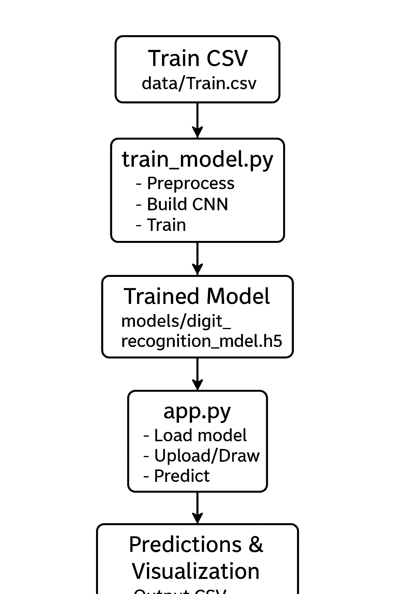
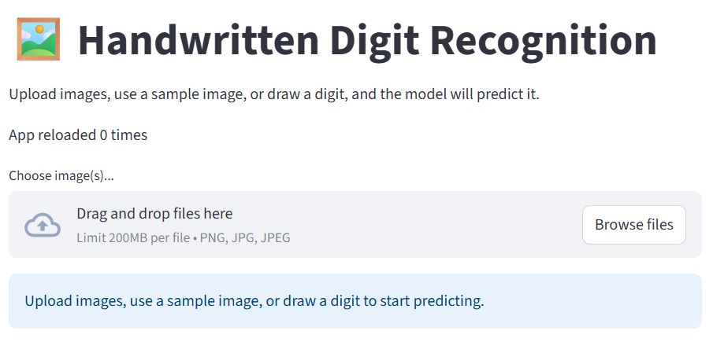
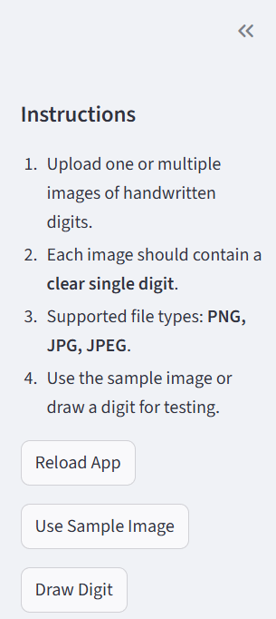
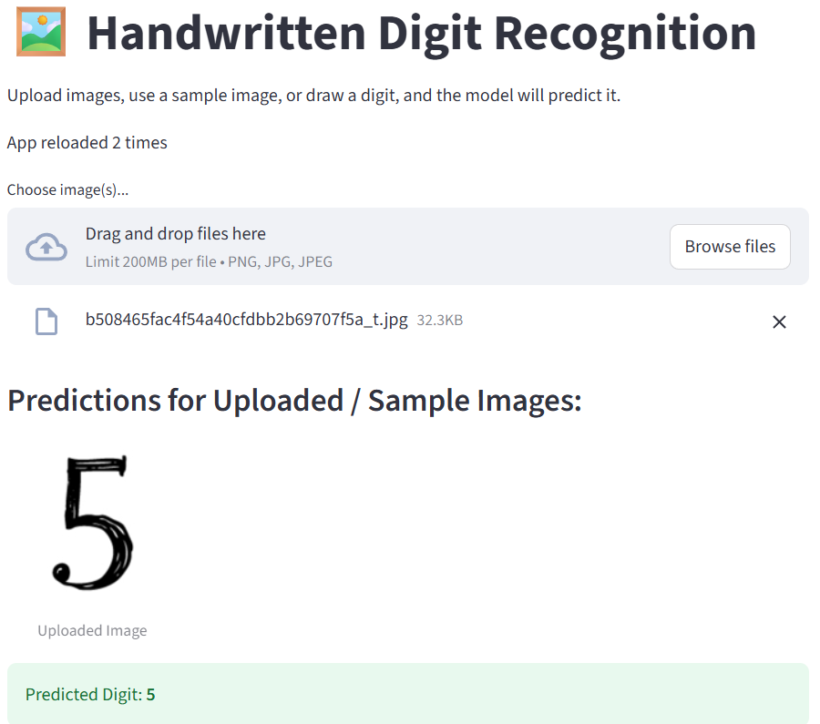
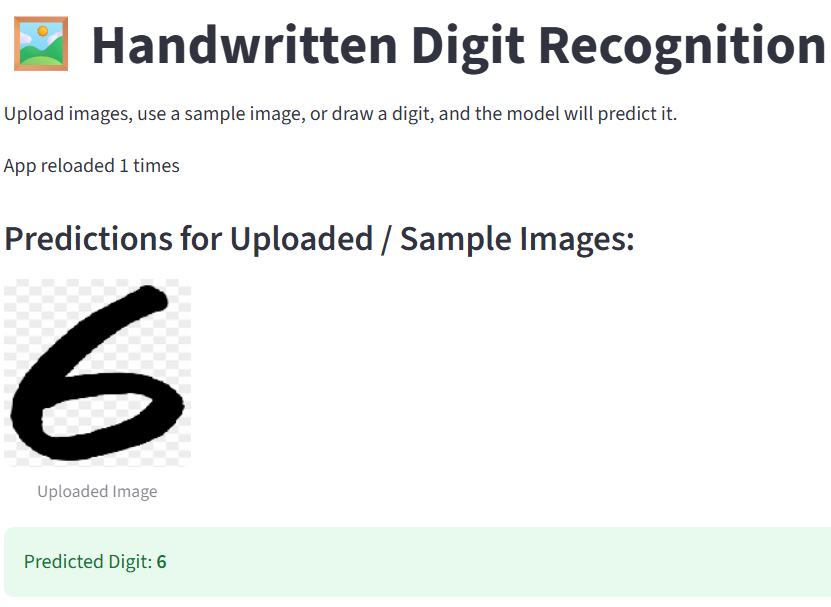
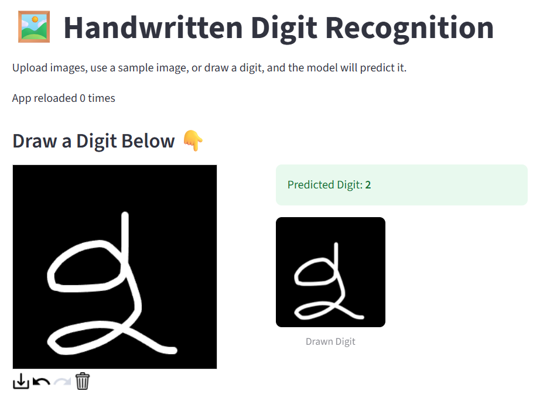

# Handwritten Digit Recognition using CNN

A simple Convolutional Neural Network (CNN) project for recognizing handwritten digits (0–9) using Python, TensorFlow/Keras, and Streamlit for a web interface.

## 📁 Repository Structure

```

digit-recognition/
├── train\_model.py               # Script to train the CNN model
├── app.py                       # Streamlit app for digit prediction
├── models/
│   └── digit\_recognition\_model.h5  # Trained model (generated after training)
├── data/
│   ├── Train.csv                # Training dataset
│   └── test.csv                 # Test dataset
├── assets/
│   └── sample\_digit.png         # Sample digit image for the app
├── requirements.txt             # Python dependencies
└── README.md

```

---

## 🧩 Workflow: Handwritten Digit Recognition



---

## ⚡ Features

- Train a CNN model to recognize handwritten digits from the MNIST-style dataset.
- Visualize training metrics (accuracy and loss) and confusion matrix.
- Save the trained model for future predictions.
- Interactive Streamlit web app:
  - Upload digit images for prediction
  - Draw digits using a canvas
  - Use a sample digit image

---

## 🛠️ Installation

1. **Clone the repository:**
```bash
git clone https://github.com/yourusername/digit-recognition.git
cd digit-recognition
````

2. **Create a virtual environment (optional but recommended):**

```bash
python -m venv venv
```

3. **Activate the environment:**

```bash
# Linux / Mac
source venv/bin/activate

# Windows
venv\Scripts\activate
```

4. **Install dependencies:**

```bash
pip install -r requirements.txt
```

---

## 🏋️ Training the Model

1. Place your training dataset (`Train.csv`) and test dataset (`test.csv`) in the `data/` folder.

2. Run the training script:

```bash
python train_model.py --train data/Train.csv --test data/test.csv --epochs 10 --batch_size 128 --output models
```

3. After training, the model will be saved as:

```
models/digit_recognition_model.h5
```

4. Training history (accuracy/loss) will also be saved as:

```
models/training_history.csv
models/training_history.png
models/confusion_matrix.png
```

---

## 🌐 Running the Streamlit App

Ensure the trained model exists at `models/digit_recognition_model.h5`.

Run the app:

```bash
streamlit run app.py
```

**App Features:**

* Upload handwritten digit images (PNG, JPG, JPEG)
* Draw digits using the canvas
* Use the sample digit image (`assets/sample_digit.png`)

**Notes:**

* Images should ideally be 28x28 pixels grayscale. Others will be resized automatically.
* If the app cannot find the model, run `train_model.py` first.

---

## 📜 Requirements

All dependencies are listed in `requirements.txt`. Key packages include:

* `numpy`
* `pandas`
* `matplotlib`
* `scikit-learn`
* `tensorflow`
* `pillow`
* `streamlit`
* `streamlit-drawable-canvas`

Install all dependencies with:

```bash
pip install -r requirements.txt
```

---

## 📷 Screenshots

### 1. Homepage View
Shows the main interface of the Digit Recognition app.


### 2. Navbar
Navigation bar for accessing different app features and instructions.


### 3. Upload & Predict
Upload a handwritten digit image and view the predicted result.


### 4. Predict Sample Image 
Predict a digit using the provided sample image.


### 5. Draw & Predict
Draw a digit on the canvas and see the predicted number.


---

## 👩‍💻 Author

**Sagarika**

